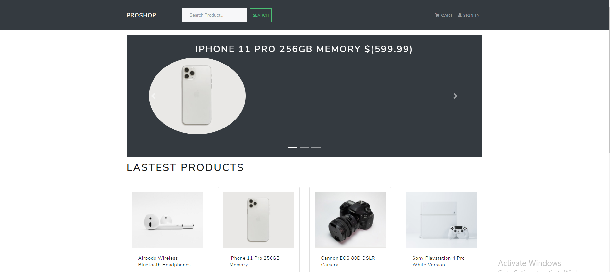

ProShop eCommerce Platform

Features:
1-Full featured shopping cart
2-Product reviews and ratings
3-Top products carousel
4-Product pagination
5-Product search feature
6-User profile with orders
7-Admin product management
8-Admin user management
9-Admin Order details page
10-Mark orders as delivered option
11-Checkout process (shipping, payment method, etc)
12-PayPal / credit card integration
13-Database seeder (products & users)

Usage:

Node >12 and npm installed

Create a .env file in then root and add the following

NODE_ENV = development
PORT = 5000
MONGO_URI = your mongodb uri
JWT_SECRET = 'abc123'
PAYPAL_CLIENT_ID = your paypal client id

Install Dependencies (frontend & backend)
npm install
cd frontend
npm install

Run
# Run frontend (:3000) & backend (:5000)
npm run dev

# Run backend only
npm run server

Build & Deploy
# Create frontend prod build
cd frontend
npm run build
There is a Heroku postbuild script, so if you push to Heroku, no need to build manually for deployment to Heroku

Seed Database
You can use the following commands to seed the database with some sample users and products as well as destroy all data

# Import data
npm run data:import

# Destroy data
npm run data:destroy
Sample User Logins

admin@example.com (Admin)
123456

john@example.com (Customer)
123456

jane@example.com (Customer)
123456

resources:
https://www.udemy.com/course/mern-ecommerce/